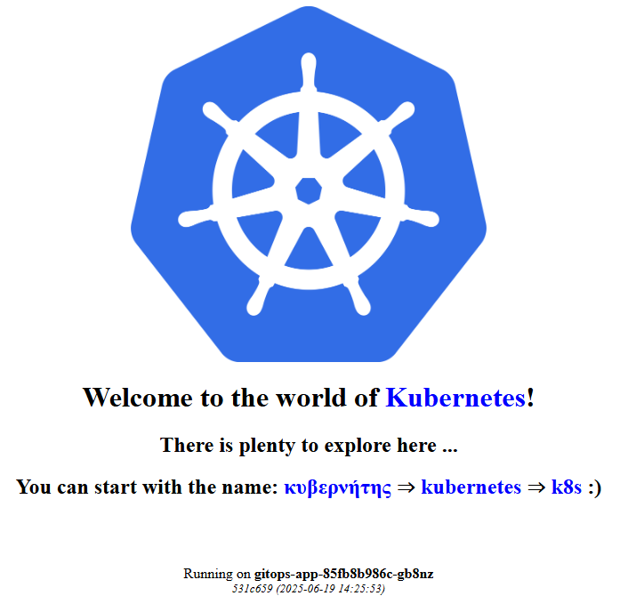

# GitOps and Kubernetes: Demo App

A sample web application that welcomes the visitor to the world of Kubernetes.

If successfully started, when the respective URL is visited, the result should look like:

## Usage

Detailed instructions are provided in the main repository (listed below).

## Supporting files

Files are provided in the following structure:

* *app* folder contains the application itself

* *helm* folder containes a Helm chart for the application

* *kustomize* folder containes kustomizations for base and two overlays - production (prd) and stage (stg)

* *manifests* folder containes a sinlge YAML manifest for the application

* *Dockerfile* is used to build the application container image

* *Jenkinsfile-CICD* contains a simple sample classic CI/CD pipeline that could be used to build and publish the container image, and then to deploy/update the application running in Kubernetes cluster

* *Jenkinsfile-GitOps* contains a simple sample pipeline that follows GitOps principles and could be used to build and publish the container image, and then to alter a dedicated infrastructure repository (which should be monitored by a GitOps operator)

## Related content

This repository is part of a pack of three repositories. The other two are: 

* **GitOps and Kubernetes** *(the main repository)* - <https://github.com/shekeriev/gitops-and-k8s>

* **GitOps and Kubernetes: Demo App Infra** *(the infrastructure repository)* - <https://github.com/shekeriev/gitops-and-k8s-demo-app-infra>